# 🧬 Subcellular Protein Location Predictor

An end-to-end Bioinformatics and Machine Learning project to predict the location of a protein within the cell based on its amino acid sequence.

## 🎯 Project Goal

In cell biology and genetic engineering, knowing the **subcellular location** of a protein is fundamental to understanding its function. A protein in the nucleus will behave very differently from one in the mitochondrion. The goal of this project is to develop an automated and accurate system that, given an amino acid sequence, can predict which cellular compartment it will reside in.

This tool aims to accelerate research and the design of synthetic proteins, allowing scientists to validate their hypotheses in silico before conducting costly and time-consuming laboratory experiments.

## 🚀 Methodology and Evolution

The project was developed iteratively, progressively increasing the complexity and performance of the system. Each phase focused on solving the bottlenecks identified in the previous one.

### Phase 1: Data Collection and Baseline Model

-   **Method:** A script was developed to download protein data for yeast (*Saccharomyces cerevisiae*) from the **UniProt** database. The initial features were **amino acid composition**, and a baseline **Random Forest** model was trained.
-   **Problem Encountered:** Performance was poor and biased towards the majority classes. Additionally, the UniProt API had technical limitations.
-   **Solution:** A **cursor-based pagination** system was implemented for robust data downloading, and **hierarchical class grouping** was used to create a cleaner, more balanced dataset.

### Phase 2: Feature and Model Improvement

-   **Method:** **k-mers** (di-peptides) features were tested, and the model was scaled up to **Gradient Boosting** algorithms (`LightGBM` and `XGBoost`) to handle the higher dimensionality.
-   **Problem Encountered:** Classes with few samples (class imbalance) remained a challenge, limiting overall performance.
-   **Solution:** A **sample weighting** strategy (`sample_weight`) was implemented to force the model to pay more attention to minority classes during training.

### Phase 3: Cutting-Edge Features with Deep Learning

-   **Methods:** The final qualitative leap was to adopt a **Deep Learning** approach. **ESM-2**, a Protein Language Model, was used to generate **embeddings** for each sequence. An embedding is a dense vector that represents the biochemical and evolutionary "meaning" of the protein.
-   **Problem Encountered:** Generating embeddings is a computationally intensive process.
-   **Solution:** A dedicated script was created to perform this pre-processing once, saving the embeddings to a file so that subsequent training would be fast.

The following diagram illustrates the complete training process flow:

## 📊 Final Results

The final combination of **ESM-2 embeddings** with an **XGBoost** model and **class weighting** proved to be the most effective. Trained on a complete dataset of **5,134 proteins** from UniProt, and after filtering that resulted in **4,994 samples** for training, the model achieved robust and generalizable performance.

The final model achieved an **overall accuracy of 64.0%** on the test set.

| Class                  | Precision | Recall    | F1-Score | Support |
|------------------------|-----------|-----------|----------|---------|
| Cytoplasm              | 0.63      | 0.68      | 0.66     | 311     |
| Endoplasmic Reticulum  | 0.48      | 0.49      | 0.48     | 65      |
| Golgi Apparatus        | 0.2       | 0.07      | 0.11     | 27      |
| Membrane               | 0.76      | 0.73      | 0.74     | 186     |
| Mitochondrion          | 0.71      | 0.59      | 0.65     | 139     |
| Nucleus                | 0.60      | 0.70      | 0.65     | 227     |
| Secreted/Extracellular | 0.79      | 0.69      | 0.73     | 16      |
| Vacuole                | 0.27      | 0.11      | 0.15     | 28      |
| **Weighted Avg**       | **0.63**  | **0.64**  | **0.63** | **999** |

#### Performance Visualization

To better understand the model's behavior, the following visualizations were generated:

-   **Confusion Matrix:** This chart shows where the model succeeds and where it fails. The values on the main diagonal represent correct predictions. We can see that the model is very robust for classes like `Membrane` and `Nucleus`, but still shows confusion in classes with fewer samples.

- **F1-Score by Class:** This chart illustrates the balanced performance (an average of precision and recall) for each class. It confirms that the model has learned significant patterns for most locations, although the performance on `Golgi Apparatus` and `Vacuole` indicates that more data would be needed to achieve the same robustness.

## 🛠️ Developments Made

The current state of the project is a complete and automated Machine Learning pipeline.

1. **Automated Pipeline (`run_pipeline.sh`):** An executable script that allows launching the entire process (download, pre-processing, embedding generation, and training) with a single command.
2. **Modular Structure:** The code is organized in `src/` with separate modules for data processing, feature generation, and training.
3. **State-of-the-Art Model:** The system uses protein embeddings (ESM-2) and an XGBoost classifier with class weighting to maximize performance.

## 🔮 Next Steps

The "brain" of the system is complete. The next steps focus on giving it a "body" and putting it into production.

1. **Create an API:** Develop an endpoint with **FastAPI** that receives a protein sequence and returns the predicted location in real-time.
2. **Containerize with Docker:** Package the entire application in a Docker container to ensure its portability.
3. **Deploy to the Cloud:** Publish the container to a cloud service to make the tool publicly accessible.

The following diagram illustrates how the API would work once deployed:

```mermaid
sequenceDiagram
    participant User as 👤 User
    participant API as 🌐 API (FastAPI)
    participant ESM2 as 🧠 ESM-2 Model
    participant XGBoost as 🌳 XGBoost Model
    participant Encoder as 🏷️ LabelEncoder

    User->>API: POST /predict with sequence: "MDSK..."
    API->>ESM2: Generate embedding for "MDSK..."
    ESM2-->>API: Returns vector [0.1, 0.9, ...]
    API->>XGBoost: Predict with the vector
    XGBoost-->>API: Returns numerical prediction (e.g., 4)
    API->>Encoder: Decode the number 4
    Encoder-->>API: Returns label "Mitochondrion"
    API-->>User: JSON: {"predicted_location": "Mitochondrion"}
```

