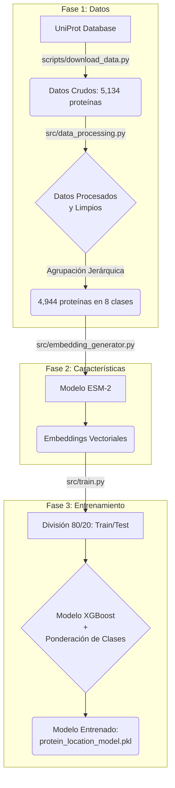
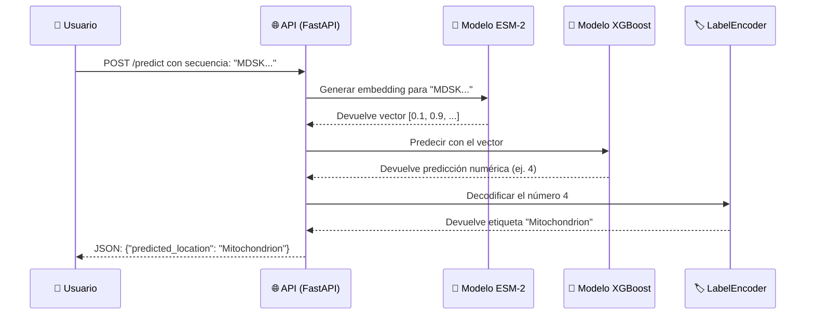

# 🧬 Predictor de Localización Subcelular de Proteínas

Un proyecto end-to-end de Bioinformática y Machine Learning para predecir la ubicación de una proteína dentro de la célula basándose en su secuencia de aminoácidos.

## 🎯 Objetivo del proyecto

En la biología celular y la ingeniería genética, conocer la **localización subcelular** de una proteína es fundamental para entender su función. Una proteína en el núcleo se comportará de manera muy diferente a una en la mitocondria. El objetivo de este proyecto es desarrollar un sistema automatizado y preciso que, dada una secuencia de aminoácidos, pueda predecir en qué compartimento celular residirá.

Esta herramienta tiene como fin acelerar la investigación y el diseño de proteínas sintéticas, permitiendo a los científicos validar in silicio sus hipótesis antes de realizar costosos y lentos experimentos en el laboratorio.

## 🚀 Metodología y Evolución

El proyecto se desarrolló de manera iterativa, aumentando progresivamente la complejidad y el rendimiento del sistema. Cada fase se centró en resolver los cuellos de botella identificados en la fase anterior.

### Fase 1: Recolección de Datos y Modelo Baseline

-   **Método:** Se desarrolló un script para descargar datos de proteínas de levadura (*Saccharomyces cerevisiae*) desde la base de datos **UniProt**. Las características iniciales fueron la **composición de aminoácidos** y se entrenó un modelo base **Random Forest**.
-   **Problema Encontrado:** El rendimiento era pobre y estaba sesgado hacia las clases mayoritarias. Además, la API de UniProt presentaba limitaciones técnicas.
-   **Solución:** Se implementó un sistema de **paginación por cursor** para la descarga robusta de datos y una **agrupación jerárquica de clases** para crear un conjunto de datos más limpio y balanceado.

### Fase 2: Mejora de Características y Modelos

-   **Método:** Se probaron características de **k-mers** (di-péptidos) y se escaló el modelo a algoritmos de **Gradient Boosting** (`LightGBM` y `XGBoost`) para manejar la mayor dimensionalidad.
-   **Problema Encontrado:** Las clases con pocas muestras (desbalance de clases) seguían siendo un desafío, limitando el rendimiento general.
-   **Solución:** Se implementó una estrategia de **ponderación de muestras** (`sample_weight`) para forzar al modelo a prestar más atención a las clases minoritarias durante el entrenamiento.

### Fase 3: Características de Vanguardia con Deep Learning

-   **Métodos:** El salto cualitativo final consistió en adoptar un enfoque de **Deep Learning**. Se utilizó **ESM-2**, un Modelo de Lenguaje de Proteínas, para generar **embeddings** de cada secuencia. Un embedding es un vector denso que representa el "significado" bioquímico y evolutivo de la proteína.
-   **Problema Encontrado:** La generación de embeddings es un proceso computacionalmente intensivo.
-   **Solución:** Se creó un script dedicado para realizar este pre-procesamiento una única vez, guardando los embeddings en un archivo para que el entrenamiento posterior fuera rápido.

El siguiente diagrama ilustra el flujo completo del proceso de entrenamiento:

## 📊 Resultados Finales

La combinación final de **embeddings de ESM-2** con un modelo **XGBoost** y **ponderación de clases** demostró ser la más efectiva. Entrenado sobre un conjunto de datos completo de **5,134 proteínas** de UniProt, y tras un filtrado que resultó en **4,994 muestras** para el entrenamiento, el modelo alcanzó un rendimiento robusto y generalizable.

El modelo final logró una **precisión general del 64.0%** en el conjunto de prueba.

| Clase                  | Precision | Recall    | F1-Score | Support |
|------------------------|-----------|-----------|----------|---------|
| Cytoplasm              | 0.63      | 0.68      | 0.66     | 311     |
| Endoplasmic Reticulum  | 0.48      | 0.49      | 0.48     | 65      |
| Golgi Apparatus        | 0.2       | 0.07      | 0.11     | 27      |
| Membrane               | 0.76      | 0.73      | 0.74     | 186     |
| Mitochondrion          | 0.71      | 0.59      | 0.65     | 139     |
| Nucleus                | 0.60      | 0.70      | 0.65     | 227     |
| Secreted/Extracellular | 0.79      | 0.69      | 0.73     | 16      |
| Vacuole                | 0.27      | 0.11      | 0.15     | 28      |
| **Weightened Avg**     | **0.63**  | **0.64**  | **0.63** | **999** |

#### Visualización del Rendimiento

Para comprender mejor el comportamiento del modelo, se generaron las siguientes visualizaciones:

-   **Matriz de Confusión:** Este gráfico muestra dónde acierta y dónde falla el modelo. Los valores en la diagonal principal representan las predicciones correctas. Podemos observar que el modelo es muy robusto para clases como `Membrane` y `Nucleus`, pero aún presenta confusiones en las clases con menos muestras.

- **F1-Score por Clase:** Este gráfico ilustra el rendimiento balanceado (una media de precisión y recall) para cada clase. Confirma que el modelo ha aprendido patrones significativos para la mayoría de las localizaciones, aunque el rendimiento en `Golgi Apparatus` y `Vacuole` indica que se necesitarían más datos para alcanzar la misma robustez.

## 🛠️ Desarrollos Realizados

El estado actual del proyecto es un pipeline de Machine Learning completo y automatizado.

1. **Pipeline Automatizado (`run_pipeline.py`):** Un script ejecutable que permite lanzar todo el proceso (descarga, pre-procesamiento, generación de embeddings y entrenamiento) con un solo comando.
2. **Estructura Modular:** El código está organizado en `src/` con módulos separados para el procesamiento de datos, la generación de características y el entrenamiento.
3. **Modelo de Vanguardia:** El sistema utiliza embeddings de proteínas (ESM-2) y un clasificador XGBoost con ponderación de clases para maximizar el rendimiento.

## 🔮 Próximos Pasos

El "cerebro" del sistema está completo. Los siguientes pasos se centran en darle un "cuerpo" y ponerlo en producción.

1. **Crear una API:** Desarrollar un endpoint con **FastAPI** que reciba una secuencia de proteína y devuelva la localización predicha en tiempo real.
2. **Contenerizar con Docker:** Empaquetar toda la aplicación en un contenedor de Docker para garantizar su portabilidad.
3. **Despliegue en la nube:** Publicar el contenedor en un servicio cloud para que la herramienta sea accesible públicamente.

El siguiente diagrama ilustra cómo funcionaría la API una vez desplegada:

